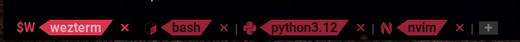

# sb_show_tabs.wezterm


 1. Show tabs with unique shapes, transparent background, having various shades of System color in the active, inactive and hovered states, and are automatically named.
 2. Allow you to use the <kbd>LEADER</kbd><kbd>t</kbd> keys and the command pallette to rename the active tab.
 3. Allow the use of <kbd>CTRL</kbd><kbd>SHIFT</kbd> <kbd>1</kbd>, <kbd>2</kbd>, <kbd>3</kbd>, <kbd>4</kbd>, <kbd>5</kbd>, <kbd>6</kbd>, <kbd>7</kbd>, <kbd>8</kbd> or <kbd>9</kbd> to move the active tab to the 1<sup>st</sup> to 9<sup>th</sup> positions.
 4. Allow the use of <kbd>ALT</kbd><kbd>SHIFT</kbd><kbd>{</kbd> and <kbd>ALT</kbd><kbd>SHIFT</kbd><kbd>}</kbd> to move the active tab relative position to the left and to the right.
 5. Allow you to customize these key presses.
 6. Show the date and time on its left end.


## Installation & Usage

```lua
local wezterm = require("wezterm")

local config = {}

if wezterm.config_builder then
    config = wezterm.config_builder()
end

-- Add these lines (to install and use the plugin with its default options):
tabs = wezterm.plugin.require("https://github.com/sunbearc22/sb_show_tabs.wezterm.git")
tabs.apply_to_config(config, {})

return config
```

## Options

**Default options**

```lua
tabs = wezterm.plugin.require("https://github.com/sunbearc22/sb_show_tabs.wezterm.git")
tabs.apply_to_config(config,
  {
    rename_tab_key = "t",                   -- see key bindings
    rename_tab_mods = "LEADER",             -- see key bindings
    move_tab_relative_left_key = "{",       -- see key bindings
    move_tab_relative_right_key = "}",      -- see key bindings
    move_tab_relative_mods = "ALT|SHIFT",   -- see key bindings
    move_tab_absolute_mods = "CTRL|SHIFT",  -- see key bindings
  }
)
```
Change the value of these option fields to your preference.

## Key Bindings

**Default keys**

| Key Binding | Action |
| :----- | :------- |
| <kbd>LEADER</kbd><kbd>t</kbd>  | Rename active tab. |
| <kbd>ALT</kbd><kbd>SHIFT</kbd><kbd>{</kbd> | Shift active tab to left. |
| <kbd>ALT</kbd><kbd>SHIFT</kbd><kbd>}</kbd> | Shift active tab to right. |
| <kbd>CTRL</kbd><kbd>SHIFT</kbd><kbd>1</kbd> | Relocate active tab to 1<sup>st</sup> position. |
| <kbd>CTRL</kbd><kbd>SHIFT</kbd><kbd>2</kbd> | Relocate active tab to 2<sup>nd</sup> position. |
| <kbd>CTRL</kbd><kbd>SHIFT</kbd><kbd>3</kbd> | Relocate active tab to 3<sup>rd</sup> position. |
| <kbd>CTRL</kbd><kbd>SHIFT</kbd><kbd>4</kbd> | Relocate active tab to 4<sup>th</sup> position. |
| <kbd>CTRL</kbd><kbd>SHIFT</kbd><kbd>5</kbd> | Relocate active tab to 5<sup>th</sup> position. |
| <kbd>CTRL</kbd><kbd>SHIFT</kbd><kbd>6</kbd> | Relocate active tab to 6<sup>th</sup> position. |
| <kbd>CTRL</kbd><kbd>SHIFT</kbd><kbd>7</kbd> | Relocate active tab to 7<sup>th</sup> position. |
| <kbd>CTRL</kbd><kbd>SHIFT</kbd><kbd>8</kbd> | Relocate active tab to 8<sup>th</sup> position. |
| <kbd>CTRL</kbd><kbd>SHIFT</kbd><kbd>9</kbd> | Relocate active tab to 9<sup>th</sup> position. |

## Update

Press <kbd>CTRL</kbd><kbd>SHIFT</kbd><kbd>L</kbd> and run `wezterm.plugin.update_all()`.

## Removal

1. Press <kbd>CTRL</kbd><kbd>SHIFT</kbd><kbd>L</kbd> and run `wezterm.plugin.list()`.
2. Delete the `"plugin_dir"` directory of this plugin.
