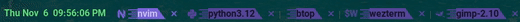
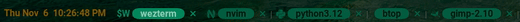
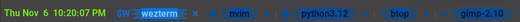

# sb_show_tabs.wezterm

1. Show tabs with unique shapes, transparent background, having various shades of System color in the active, inactive and hovered states, and are automatically named.
   
   
2. Allow you to use the <kbd>LEADER</kbd><kbd>t</kbd> keys and the command pallette to rename the active tab.
3. Provides key bindings to activate different tab and reposition the active tab (see Key Bindings). Also, you can change these key bindings.
   
   
4. Show the date and time on the left side of the tab bar.

## Installation & Usage

```lua
local wezterm = require("wezterm")

local config = {}

if wezterm.config_builder then
    config = wezterm.config_builder()
end

-- Add these lines (to install and use the plugin with its default options):
local repo = "https://github.com/sunbearc22/sb_show_tabs.wezterm.git"
wezterm.plugin.require(repo).apply_to_config(config, {})

return config
```

## Options

**Default options**

```lua
local repo = "https://github.com/sunbearc22/sb_show_tabs.wezterm.git"
wezterm.plugin.require(repo).apply_to_config(config,
  {
    rename_tab_key = "t",       -- see key bindings
    rename_tab_mods = "LEADER", -- see key bindings
    activate_left_key = "[",    -- see key bindings
    activate_right_key = "]",   -- see key bindings
    activate_mods = "ALT",      -- see key bindings
    move_left_key = "{",        -- see key bindings
    move_right_key = "}",       -- see key bindings
    move_mods = "ALT|SHIFT",    -- see key bindings
    snums = { "!", "@", "#", "$", "%", "^", "&", "*", "(" },  -- see key bindings
  }
)
```
Change the value of these option fields to your preference.

## Key Bindings

**Default keys**

_Rename Tab_
| Key Binding | Action |
| :----- | :------- |
| <kbd>LEADER</kbd><kbd>t</kbd>  | Rename active tab. |

_Activate Tab_
| Key Binding | Action |
| :----- | :------- |
| <kbd>ALT</kbd><kbd>{</kbd> | Activate left tab. |
| <kbd>ALT</kbd><kbd>}</kbd> | Activate right tab. |
| <kbd>ALT</kbd><kbd>1</kbd> | Activate 1<sup>st</sup> tab. |
| <kbd>ALT</kbd><kbd>2</kbd> | Activate 2<sup>nd</sup> tab. |
| <kbd>ALT</kbd><kbd>3</kbd> | Activate 3<sup>rd</sup> tab. |
| <kbd>ALT</kbd><kbd>4</kbd> | Activate 4<sup>th</sup> tab. |
| <kbd>ALT</kbd><kbd>5</kbd> | Activate 5<sup>th</sup> tab. |
| <kbd>ALT</kbd><kbd>6</kbd> | Activate 6<sup>th</sup> tab. |
| <kbd>ALT</kbd><kbd>7</kbd> | Activate 7<sup>th</sup> tab. |
| <kbd>ALT</kbd><kbd>8</kbd> | Activate 8<sup>th</sup> tab. |
| <kbd>ALT</kbd><kbd>9</kbd> | Activate 9<sup>th</sup> tab. |

_Move Tab_
| Key Binding | Action |
| :----- | :------- |
| <kbd>ALT</kbd><kbd>SHIFT</kbd><kbd>{</kbd> | Move tab to the left. |
| <kbd>ALT</kbd><kbd>SHIFT</kbd><kbd>}</kbd> | Move tab to the right. |
  <kbd>ALT</kbd><kbd>SHIFT</kbd><kbd>!</kbd> | Move tab to 1<sup>st</sup> position. |
| <kbd>ALT</kbd><kbd>SHIFT</kbd><kbd>@</kbd> | Move tab to 2<sup>nd</sup> position. |
| <kbd>ALT</kbd><kbd>SHIFT</kbd><kbd>#</kbd> | Move tab to 3<sup>rd</sup> position. |
| <kbd>ALT</kbd><kbd>SHIFT</kbd><kbd>$</kbd> | Move tab to 4<sup>th</sup> position. |
| <kbd>ALT</kbd><kbd>SHIFT</kbd><kbd>%</kbd> | Move tab to 5<sup>th</sup> position. |
| <kbd>ALT</kbd><kbd>SHIFT</kbd><kbd>^</kbd> | Move tab to 6<sup>th</sup> position. |
| <kbd>ALT</kbd><kbd>SHIFT</kbd><kbd>&</kbd> | Move tab to 7<sup>th</sup> position. |
| <kbd>ALT</kbd><kbd>SHIFT</kbd><kbd>\*</kbd> | Move tab to 8<sup>th</sup> position. |
| <kbd>ALT</kbd><kbd>SHIFT</kbd><kbd>(</kbd> | Move tab to 9<sup>th</sup> position. |

_WezTerm default keys_
| Key Binding | Action |
| :----- | :------- |
| <kbd>Super</kbd><kbd>Shift</kbd><kbd>[</kbd> | Activate left tab.  |
| <kbd>Super</kbd><kbd>Shift</kbd><kbd>]</kbd> |  Activate right tab. |
| <kbd>Ctrl</kbd><kbd>Shift</kbd><kbd>Tab</kbd> | Activate left tab.. |
| <kbd>Ctrl</kbd><kbd>Tab</kbd> | Activate right tab. |

## Update

Press <kbd>CTRL</kbd><kbd>SHIFT</kbd><kbd>L</kbd> and run `wezterm.plugin.update_all()`.

## Removal

1. Press <kbd>CTRL</kbd><kbd>SHIFT</kbd><kbd>L</kbd> and run `wezterm.plugin.list()`.
2. Delete the `"plugin_dir"` directory of this plugin.
